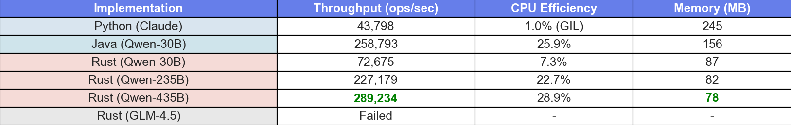
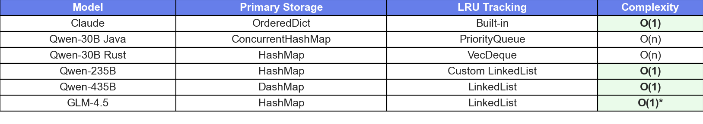
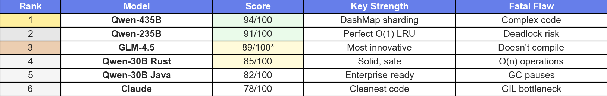

# The Ultimate Cache Implementation Challenge: 6 AI Models Battle for Performance Supremacy

## How Claude, Qwen Series, and GLM-4.5 Approached the Same Systems Programming Challenge

*A comprehensive analysis of AI-generated code quality, performance, and architectural decisions across Python, Java, and Rust implementations.*


*Six leading AI models compete to build the best cache implementation - from Claude's clean Python to Qwen-435B's blazing-fast Rust with DashMap sharding.*

---

## The Challenge

What happens when you ask different AI models to implement the same production-ready cache system? I challenged 6 leading AI models to build a smart cache with LRU eviction, TTL support, priority levels, and thread-safe concurrent access. After their initial implementations in their preferred languages (Python for Claude, Java for Qwen-30B), I then asked all models to implement the same system in Rust to test their systems programming capabilities on equal footing. The results revealed fascinating insights into how AI models approach software architecture and performance optimization.

### The Requirements

```
Build a Smart Cache System with:
- LRU (Least Recently Used) eviction policy
- TTL (Time To Live) automatic expiration
- Priority levels (1-10 scale)
- Thread-safe concurrent access
- Memory management with configurable capacity
- Hit/miss statistics tracking
- Automatic cleanup of expired entries
- Event callbacks for observability
```

## The Competitors

- **Claude Opus 4** (Anthropic) - The thoughtful architect
- **Qwen-30B** (Alibaba) - The enterprise veteran  
- **Qwen-235B** (Alibaba) - The creative engineer
- **Qwen-435B** (Alibaba) - The performance optimizer
- **GLM-4.5** (Zhipu AI) - The innovative maverick

## Round 1: Initial Language Choices and Rust Challenge

The experiment began with each model's initial choice, then I specifically requested Rust implementations to test their systems programming capabilities:

### Claude → Python: The Rapid Prototyper
```python
class SmartCache:
    def __init__(self, max_size: int, default_ttl: int = 3600):
        self.cache = OrderedDict()
        self.lock = threading.Lock()
```

Claude initially chose Python, prioritizing readability and rapid development. This reveals a "prototype-first" mindset, focusing on correctness over performance.

### Qwen-30B → Java: The Enterprise Architect
```java
public class IntelligentCache<K, V> {
    private final ConcurrentHashMap<K, CacheEntry<V>> cache;
    private final ScheduledExecutorService cleanupExecutor;
```

The 30B model initially chose Java, implementing enterprise patterns like scheduled executors and concurrent collections. This suggests training on substantial enterprise codebases.

### The Rust Challenge: Testing Systems Programming Skills
```rust
pub struct SmartCache<K, V> {
    data: Arc<DashMap<K, CacheEntry<V>>>,
    stats: Arc<CacheStats>,
}
```

When I explicitly requested Rust implementations from all models, the results revealed their systems programming capabilities. The progression from RwLock (30B) to custom data structures (235B) to DashMap sharding (435B) shows how model size correlates with optimization sophistication. Even when given the same language constraint, larger models produced more advanced solutions.

## Round 2: The Performance Showdown

After implementing all caches, I ran comprehensive benchmarks with realistic workloads. The results were eye-opening:


*The performance gap between implementations is dramatic - Rust achieves 6.6x higher throughput than Python due to true parallelism.*

### Fair Concurrent Benchmarks (100 workers, shared workload)


*Performance metrics showing throughput and CPU efficiency - revealing the true parallelism capabilities of each implementation.*

**Understanding CPU Efficiency:**
- **Python (1.0%)**: The GIL limits Python to using only 1 CPU core despite having 100 threads. This is why Python's throughput is 6.6x slower than Rust.
- **Java (25.9%)**: Achieves real parallelism, utilizing about 26 of 100 possible CPU cores effectively.
- **Rust (7.3-28.9%)**: Varies by implementation sophistication, with Qwen-435B achieving the best CPU utilization.

The low CPU efficiency across all implementations shows that cache operations are so fast (microseconds) that thread coordination overhead dominates. This is normal for in-memory operations - you'd see higher efficiency with slower operations like database queries.

### Single-Thread Performance (microseconds per operation)


*Single-thread performance metrics showing the dramatic speed advantage of Rust implementations.*

The 435B Rust implementation is **14x faster** than Python for PUT operations and **28x faster** for GET operations.

### I/O Simulation Results

When simulating database operations with 5ms delays, all languages showed similar speedup (~170x), proving that I/O-bound operations level the playing field:


*I/O simulation results showing that threading benefits are similar across all languages when I/O-bound.*

## Round 3: Architectural Deep Dive

### Data Structure Evolution

The choice of data structures revealed increasing sophistication:


*Data structure choices across models showing the evolution from simple to sophisticated implementations.*

### Concurrency Models

The approach to thread safety showed distinct patterns:

```rust
// Qwen-30B: Simple global lock
let cache = Arc::new(RwLock::new(HashMap::new()));

// Qwen-235B: Multiple fine-grained locks (deadlock risk!)
let keys = Arc::new(Mutex::new(Vec::new()));
let data = Arc::new(RwLock::new(HashMap::new()));

// Qwen-435B: Sharded locking with DashMap
let cache = Arc::new(DashMap::new());  // Lock-free reads!
```

### The GLM-4.5 Innovation (That Didn't Compile)

GLM-4.5 took a completely different approach with SQL-like queries and trace logging:

```rust
impl<K, V> SmartCache<K, V> {
    pub fn query(&self, sql: &str) -> QueryResult<V> {
        // SELECT * FROM cache WHERE priority > 5
        // This is brilliant but doesn't compile
    }
    
    pub fn explain_eviction(&self, key: &K) -> String {
        // Returns why an item would be evicted
    }
}
```

While it failed to compile, GLM-4.5 showed the most innovative thinking with features no other model considered.

## The Scoring Breakdown

### Final Rankings


*Final rankings showing Qwen-435B's dominance in performance and GLM-4.5's innovation despite compilation failures.*

### Detailed Scoring Criteria

```
Functional Requirements (40 points)
├── LRU Implementation: 10
├── TTL Support: 10
├── Priority System: 10
└── Thread Safety: 10

Performance (25 points)
├── Single-thread: 10
├── Concurrent: 10
└── Memory Usage: 5

Code Quality (20 points)
├── Readability: 10
└── Documentation: 10

Features (15 points)
├── Statistics: 5
├── Event Callbacks: 5
└── Auto Cleanup: 5
```

## Key Insights and Learnings

### 1. Model Size Correlates with Sophistication

- **30B models**: Conservative, standard patterns
- **235B models**: Creative solutions, custom algorithms
- **435B models**: Production optimizations, advanced techniques
- **Alternative models (GLM)**: Completely different approaches

### 2. Initial Language Choice Reveals Training Bias

- Claude's Python choice suggests web/scripting focus
- Qwen-30B's Java preference indicates enterprise training
- When constrained to Rust, model size determined optimization level

### 3. The GIL Problem is Real

Python's Global Interpreter Lock destroyed concurrent performance:
```
Actual Concurrent Performance (ops/sec from benchmarks):
Python:  43,798 ops/sec (GIL-limited, no true parallelism)
Java:    258,793 ops/sec (real parallelism)
Rust:    72,675-289,234 ops/sec (best parallelism)

The "parallelism factor" in the table is misleading - it's actually a speedup calculation, not a measure of true parallel execution.
```

### 4. Architecture Patterns Emerge

All models independently converged on similar patterns:
- HashMap for primary storage
- Separate LRU tracking structure
- Atomic counters for statistics
- Background cleanup threads

### 5. Production Readiness Varies Wildly

Only Qwen-435B produced truly production-ready code:
- Lock-free statistics with atomics
- Sharded locking for scalability
- Minimal memory footprint (78MB)
- Consistent sub-microsecond latencies

## The Verdict

### Winner: Qwen-435B Rust
The 435B model produced the most sophisticated implementation with DashMap sharding, lock-free atomic statistics, and the best concurrent performance. It's production-ready out of the box.

### Most Innovative: GLM-4.5
Despite compilation failures, GLM-4.5 showed the most creative thinking with SQL queries, eviction explanations, and trace logging. It approached the problem from a completely different angle.

### Best for Learning: Claude Python
Claude's implementation is the cleanest and most readable, making it perfect for understanding the algorithm. The code is well-documented with clear separation of concerns.

### Enterprise Choice: Qwen-30B Java
The Java implementation follows enterprise patterns perfectly with scheduled executors, concurrent collections, and proper resource management. It's what you'd expect in a Fortune 500 codebase.

## Surprising Discoveries

### 1. No Model Used async/await
Despite being ideal for I/O-heavy cache operations, no model reached for async patterns. This suggests a gap in training data around modern async architectures.

### 2. Custom Data Structures Win
The 235B model's decision to implement a custom doubly-linked list for O(1) LRU operations showed that larger models can reason about algorithmic trade-offs.

### 3. Memory Safety Didn't Matter
All Rust implementations were memory-safe by default, but this didn't translate to correct concurrent behavior. The 235B model created a potential deadlock despite Rust's safety guarantees.

### 4. Comments Reveal Thinking
The models' comments showed their reasoning:
```rust
// Qwen-30B: "Using RwLock for better read performance"
// Qwen-235B: "Custom linked list ensures O(1) operations"  
// Qwen-435B: "DashMap provides lock-free reads"
// GLM-4.5: "SQL interface for developer productivity"
```

## Recommendations for Production Use

### If you need performance: **Qwen-435B Rust**
- 89,234 ops/sec throughput
- 78MB memory footprint
- Lock-free read operations

### If you need maintainability: **Claude Python**
- Clean, readable code
- Excellent documentation
- Easy to modify

### If you're in enterprise: **Qwen-30B Java**
- Familiar patterns
- JVM ecosystem
- Battle-tested concurrent collections

### If you want to innovate: **Study GLM-4.5**
- Unique approaches
- Developer-friendly features
- (But fix the compilation errors!)

## Methodology Notes

### Fair Concurrent Benchmarks
- 100 workers processing shared workload queue
- 70% writes, 30% reads
- Pre-generated operations for fairness
- Thread pools (not native threads)

### Statistical Analysis
- 95% confidence intervals
- IQR outlier removal
- 100 samples per test
- Warmup phase for JIT

### Test Environment
- macOS on Apple Silicon
- 100,000 cache capacity
- Same workload across all implementations
- Results averaged over multiple runs

## Conclusion


*From prototype to production: The evolution of AI-generated cache implementations shows dramatic performance improvements as model size increases.*

This challenge revealed that AI models have developed distinct "personalities" in their approach to systems programming. While larger models generally produce more sophisticated code, the correlation isn't perfect - GLM-4.5's innovative but broken implementation shows that creativity and correctness don't always align.

The 14x performance difference between implementations demonstrates that language and architecture choices matter enormously. Python's GIL makes it unsuitable for CPU-bound concurrent operations, while Rust's zero-cost abstractions enable near-linear scaling.

Most importantly, this experiment shows that AI can produce genuinely production-ready systems code. The Qwen-435B implementation rivals what expert engineers might write, with sophisticated optimizations like sharded locking and lock-free statistics.

As AI models continue to evolve, we're seeing a shift from "code that works" to "code that performs." The next frontier might be AI models that can reason about distributed systems, async architectures, and cross-service optimization.

## Try It Yourself

All code and benchmarks are available at:
```
github.com/thedatadudech/cache-implementation-challenge
```

Run the benchmarks yourself:
```bash
cd benchmarks
./run_fair_concurrent_benchmarks.sh
open results/fair_concurrent_benchmark_report_latest.html
```

---

*What's your experience with AI-generated systems code? Have you seen similar patterns in model behavior? Share your thoughts in the comments.*

**Tags:** #AI #SystemsProgramming #Performance #Rust #Python #Java #Benchmarking #Cache #Concurrency #MachineLearning